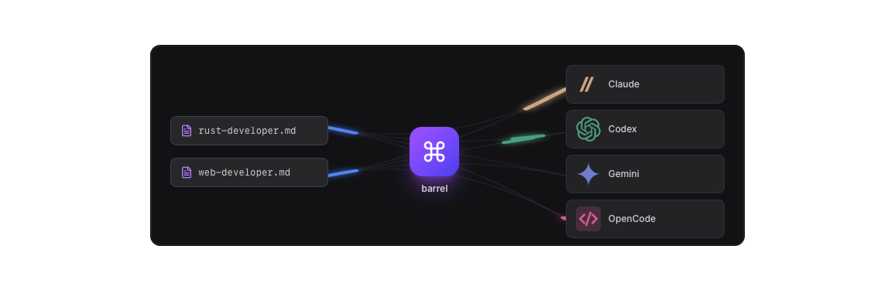

# axel

A CLI for AI-assisted development. Portable agents across LLMs. Reproducible terminal workspaces.

## The Problem

Vibe coding is here. LLMs are racing to top benchmarks with infinite funding behind them. You want to switch when one pulls ahead—but your agents are stuck in `.claude/` or `.codex/`.

Not using agents? You're leaving most of the LLM potential on the table. Copy-pasting them between tools? They drift out of sync.

Meanwhile, your terminal is chaos and your IDE crashes and keep losing context.

**axel fixes both and going beyond.**

## Features

### Agent Portability

Write your agents once. axel symlinks them wherever they need to go.

```
agents/
  code-reviewer.md
  frontend-engineer.md
  security-auditor.md
```




Switch LLMs by changing one line. No more copy-pasting between `.claude/agents/` and `.codex/agents/`.

### Reproducible Workspaces

One command. Your entire workspace materializes.

```yaml
# AXEL.md (frontmatter)
workspace: myproject

shells:
  - type: claude
    agents: ["*"]
  - type: shell
    path: ./backend
  - type: shell
    path: ./frontend

terminal:
  profiles:
    default:
      type: tmux
      claude:
        col: 0
        row: 0
      backend:
        col: 1
        row: 0
      frontend:
        col: 1
        row: 1
```

```bash
axel
```


Claude on the left, servers on the right. Close everything, come back tomorrow, run `axel` again—exactly where you left off.

## Installation

```bash
curl -sL https://install.axel.md | bash
```

Or build from source:

```bash
cargo install --path crates/cli
```

### Prerequisites

- [tmux](https://github.com/tmux/tmux) for workspace management
- One or more AI coding assistants

### Supported LLMs

Agents can be dispatched to any of the following LLM:

- [x] [Claude Code](https://claude.ai/code) - Anthropic
- [x] [Codex](https://openai.com/codex) - OpenAI
- [x] [OpenCode](https://opencode.ai) - Open source
- [x] [Antigravity](https://antigravityai.org) - Google

## Quick Start

> See the full [Quick Start guide](https://docs.axel.md/quick-start) for detailed instructions.

```bash
# Initialize a workspace in current directory
axel init

# Import your existing agents
axel agent import ./.claude/agents/web-developer.md
axel agent import ./agents/

# Launch a single AI shell (agents are symlinked automatically)
axel claude

# Or launch the full workspace
axel
```

> **Note:** `axel bootstrap` exists to auto-discover agents across your machine, but it's experimental. We recommend manually importing agents with `axel agent import <file|dir>` for more control.

## Usage

```bash
# Daily workflow
axel                          # Launch workspace from AXEL.md
axel -w feat/auth             # Launch in a git worktree
axel -k                       # Kill session and clean up

# Sessions
axel session list             # List running sessions
axel session join <name>      # Attach to a session
axel session kill <name>      # Kill a session

# Agents
axel agent list               # List all agents
axel agent import <path>      # Import from file or directory
axel agent new                # Create a new agent
axel agent fork <name>        # Copy global agent locally
axel agent link <name>        # Symlink global agent locally
```

See the [CLI Reference](https://docs.axel.md/commands) for all options.

## Configuration

### Shells

Define what runs in each pane:

```yaml
shells:
  # AI assistants
  - type: claude
    agents: ["code-reviewer", "frontend-engineer"]
    model: claude-sonnet-4-20250514

  - type: codex
    agents: ["*"]  # All agents

  - type: antigravity
    agents: ["*"]

  # Custom commands
  - type: shell
    path: ./backend
    command: npm run dev

  - type: shell
    path: ./frontend
    command: pnpm dev
```

### Profiles

Define terminal layouts:

```yaml
terminal:
  profiles:
    default:
      type: tmux  # tmux, tmux_cc (iTerm2), or shell
      claude:
        col: 0
        row: 0
      backend:
        col: 1
        row: 0
        height: 50
      frontend:
        col: 1
        row: 1
```

### Agents

Centralize your agents:

```yaml
agents:
  - path: ./agents           # Local agents
  - path: ~/.config/axel/agents  # Global agents
```

## For Developers Who

- Run multiple AI coding assistants and are tired of maintaining separate configs
- Work across several repositories that need to be running simultaneously
- Want reproducible dev environments they can spin up instantly
- Believe their tooling should adapt to them, not the other way around

## Links

- [Website](https://axel.md)
- [Documentation](https://docs.axel.md)

## License

MIT
